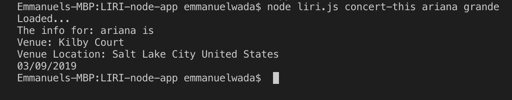

# LIRI-node-app
**install & require**

axios, 
spotify API,
moment.js,
FS (filesystem)

**instructions**

clone and run npm install.

set up keys for the above APIs.

Start by querying in the command line by typing node liri.js. 
This will let node to run the liri.js file, then type in the command 
*spotify-this-song* followed by the title of the song. Reapeat for all the other commands
as well. For *do-what-it-says* type "node liri.js and then do-what-it-says". 
Type in the below in the the command line:

   **search for concerts**
   
   

        node liri.js concert-this <artist/band name here>

   **search spotify by song**

        node liri.js spotify-this-song '<song name here>'

   **search for movies**

        node liri.js movie-this '<movie name here>'

  **search for a random topic**

        node liri.js do-what-it-says

